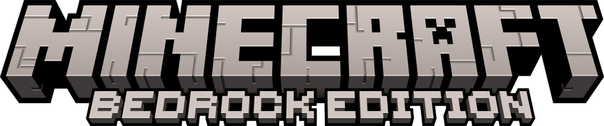

# ⛏️​ Minecraft-Bedrock-Addons ⛏️​
A collection of Minecraft Bedrock addons I made, now free for you to use and modify as you wish.

📌 You can find my original addons on [my MCPEDL page](https://mcpedl.com/user/darkalardev).

## 💰 Donations
❤️​ All donations go directly toward the development of my own games and the creation of free addons for Godot. Your support helps me create more and better projects. 
  
 
 

# 📄​ License
1. This project is licensed under the MIT License. You are free to modify and use it however you like. Credit is not required, but always appreciated.
2. The addons in this repository were created by Agustin Adducci (Darkalar), who was responsible for design and programming, and Lian Guber (SovietLian), who contributed the artistic work.
3. The Minecraft Bedrock Edition logo used in this project is the property of Mojang Studios. All rights to the logo and related assets are owned by Mojang and are used here for non-commercial/fair use purposes. This project is not affiliated with or endorsed by Mojang or Microsoft.
